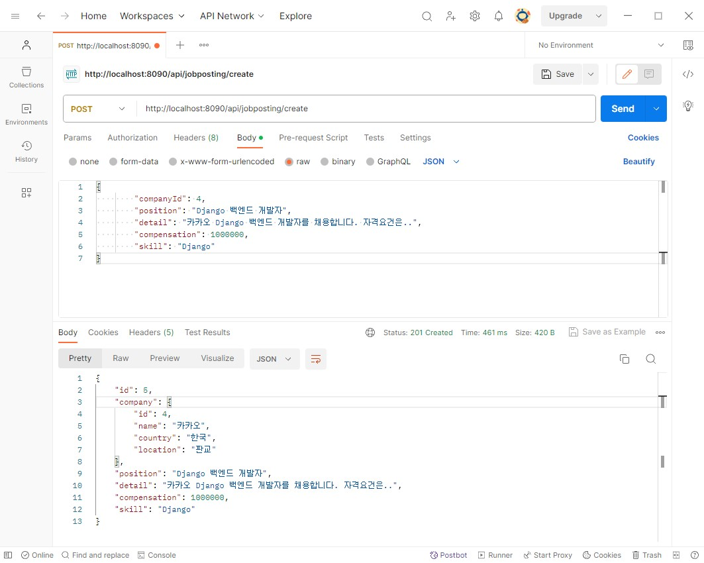

# wanted-pre-onboarding-backend

### 1. 요구사항 분석
- 서비스 개요
본 서비스는 기업의 채용을 위한 웹 서비스 입니다.
회사는 채용공고를 생성하고, 이에 사용자는 지원합니다.

- <strong>기능적 요구사항</strong>
1. **채용공고를 등록합니다.**

    <aside>
    ➡️ 회사는 아래 데이터와 같이 채용공고를 등록합니다.

    </aside>

    ```json
    Example)
    # 데이터 예시이며, 필드명은 임의로 설정가능합니다.
    {
      "회사_id":회사_id,
      "채용포지션":"백엔드 주니어 개발자",
      "채용보상금":1000000,
      "채용내용":"원티드랩에서 백엔드 주니어 개발자를 채용합니다. 자격요건은..",
      "사용기술":"Python"
    }
    ```

2. **채용공고를 수정합니다.**

    <aside>
    ➡️ 회사는 아래 데이터와 같이 채용공고를 수정합니다. (회사 id 이외 모두 수정 가능합니다.)

    </aside>

    ```json
    Example)
    # 데이터 예시이며, 필드명은 임의로 설정가능합니다.
    {
      "채용포지션":"백엔드 주니어 개발자",
      "채용보상금":1500000, # 변경됨
      "채용내용":"원티드랩에서 백엔드 주니어 개발자를 '적극' 채용합니다. 자격요건은..", # 변경됨
      "사용기술":"Python"
    }
    
    or
    
    {
      "채용포지션":"백엔드 주니어 개발자",
      "채용보상금":1000000,
      "채용내용":"원티드랩에서 백엔드 주니어 개발자를 채용합니다. 자격요건은..",
      "사용기술":"Django" # 변경됨
    }
    ```

3. **채용공고를 삭제합니다.**

    <aside>
    ➡️ DB에서 삭제됩니다.

    </aside>

4. **채용공고 목록을 가져옵니다.**

    <aside>
    ➡️ 4-1. 사용자는 채용공고 목록을 아래와 같이 확인할 수 있습니다.

    </aside>

    ```json
    Example)
    [
    	{
    		"채용공고_id": 채용공고_id,
    	  "회사명":"원티드랩",
    	  "국가":"한국",
    	  "지역":"서울",
    	  "채용포지션":"백엔드 주니어 개발자",
    	  "채용보상금":1500000,
    	  "사용기술":"Python"
    	},
    	{
    		"채용공고_id": 채용공고_id,
    	  "회사명":"네이버",
    	  "국가":"한국",
    	  "지역":"판교",
    	  "채용포지션":"Django 백엔드 개발자",
    	  "채용보상금":1000000,
    	  "사용기술":"Django"
    	},
      ...
    ]
    ```

    <aside>
    ➡️ 4-2. 채용공고 검색 기능 구현**(선택사항 및 가산점요소).**

    </aside>

    ```json
    # Example - 1) some/url?**search=원티드**
    [
    	{
    		"채용공고_id": 채용공고_id,
    	  "회사명":"원티드랩",
    	  "국가":"한국",
    	  "지역":"서울",
    	  "채용포지션":"백엔드 주니어 개발자",
    	  "채용보상금":1500000,
    	  "사용기술":"Python"
    	},
    	{
    		"채용공고_id": 채용공고_id,
    	  "회사명":"원티드코리아",
    	  "국가":"한국",
    	  "지역":"부산",
    	  "채용포지션":"프론트엔드 개발자",
    	  "채용보상금":500000,
    	  "사용기술":"javascript"
    	}
    ]
    
    # Example - 2) some/url?**search=Django**
    [
    	{
    		"채용공고_id": 채용공고_id,
    	  "회사명":"네이버",
    	  "국가":"한국",
    	  "지역":"판교",
    	  "채용포지션":"Django 백엔드 개발자",
    	  "채용보상금":1000000,
    	  "사용기술":"Django"
    	},
    	{
    		"채용공고_id": 채용공고_id,
    	  "회사명":"카카오",
    	  "국가":"한국",
    	  "지역":"판교",
    	  "채용포지션":"Django 백엔드 개발자",
    	  "채용보상금":500000,
    	  "사용기술":"Python"
    	}
      ...
    ]
    ```

5. **채용 상세 페이지를 가져옵니다.**

    <aside>
    ➡️ 사용자는 채용상세 페이지를 아래와 같이 확인할 수 있습니다.

    - “채용내용”이 추가적으로 담겨있음.
    - 해당 회사가 올린 다른 채용공고 가 추가적으로 포함됩니다**(선택사항 및 가산점요소).**
    </aside>

    ```json
    Example)
    {
    "채용공고_id": 채용공고_id,
    "회사명":"원티드랩",
    "국가":"한국",
    "지역":"서울",
    "채용포지션":"백엔드 주니어 개발자",
    "채용보상금":1500000,
    "사용기술":"Python",
    "채용내용": "원티드랩에서 백엔드 주니어 개발자를 채용합니다. 자격요건은..",
    "회사가올린다른채용공고":[채용공고_id, 채용공고_id, ..] # id List (선택사항 및 가산점요소).
    }
    ```

6. **사용자는 채용공고에 지원합니다(선택사항 및 가산점요소).**

    <aside>
    ➡️ 사용자는 채용공고에 아래와 같이 지원합니다. (가점 요소이며, 필수 구현 요소가 아님)

    - 사용자는 1회만 지원 가능합니다.
    </aside>

    ```json
    Example)
    {
    	"채용공고_id": 채용공고_id,
      "사용자_id": 사용자_id
    }
    ```

### 2. 구현 과정
1. **프로젝트 설정 및 초기 세팅:**

2. **ERD 작성:**

3. **채용공고 등록 기능 구현**

   ```agsl
    public JobPosting createJobPosting(JobPostingDTO jobPostingDTO) {
        JobPosting jobPosting = new JobPosting();
        BeanUtils.copyProperties(jobPostingDTO, jobPosting);

        Integer companyId = jobPostingDTO.getCompanyId();
        Company company = companyRepository.findById(companyId)
                .orElseThrow(() -> new RuntimeException("해당 ID의  회사를 찾을 수 없음 : " + companyId));

        jobPosting.setCompany(company);

        return jobPostingRepository.save(jobPosting);
    }
   ```
   <aside>
   *️⃣ JobPostingDTO에서 필요한 정보를 추출하여 JobPosting 객체를 생성하고 해당 객체에 회사 정보를 추가한 후 저장.
   </aside>

   ```agsl
    @PostMapping("/create")
       public ResponseEntity<JobPosting> createJobPosting(@RequestBody JobPostingDTO jobPostingDTO) {
           JobPosting jobPosting = jobPostingService.createJobPosting(jobPostingDTO);
           return new ResponseEntity<>(jobPosting, HttpStatus.CREATED);
       }
   ```
   <aside>
   *️⃣ 클라이언트가 전송한 JobPostingDTO를 jobPostingService.createJobPosting 메서드를 호출하여 채용공고를 생성. 생성된 공고를 ResponseEntity에 담아 HTTP 상태코드와 함께 반환.
   </aside>

   - **api 요청 테스트**


2. 채용공고 수정 기능
   ```agsl
   public JobPosting updateJobPosting(Integer id, JobPostingDTO jobPostingDTO) {
           JobPosting jobPosting = jobPostingRepository.findById(id)
                   .orElseThrow(() -> new RuntimeException("해당 id의 채용공고 찾을 수 없음 : "+ id));
   
           jobPosting.setPosition(jobPostingDTO.getPosition());
           jobPosting.setCompensation(jobPostingDTO.getCompensation());
           jobPosting.setDetail(jobPostingDTO.getDetail());
           jobPosting.setSkill(jobPostingDTO.getSkill());
   
           return jobPostingRepository.save(jobPosting);
       }
   ```
   <aside>
   *️⃣ jobPostingRepository.findById(id)를 사용하여 id에 해당하는 채용공고를 찾고 jobpostingDTO로부터 받은 정보를 사용하여 채용공고를 업데이트.
   </aside>

   ```agsl
    @PutMapping("/update/{id}")
       public ResponseEntity<JobPosting> updateJobPosting(@PathVariable Integer id, @RequestBody JobPostingDTO jobPostingDTO) {
           JobPosting jobPosting = jobPostingService.updateJobPosting(id, jobPostingDTO);
           return new ResponseEntity<>(jobPosting, HttpStatus.OK);
       }
   ```

3. 