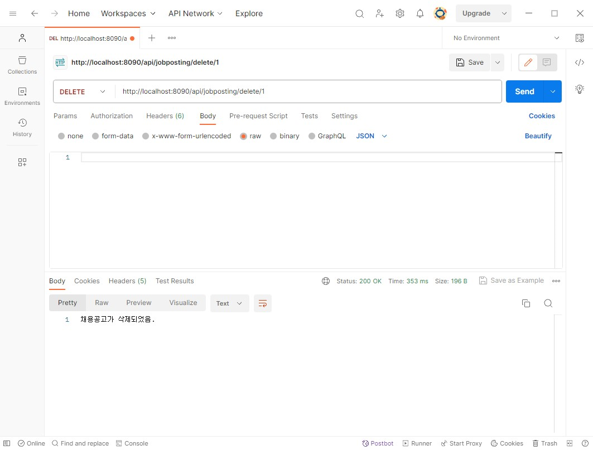
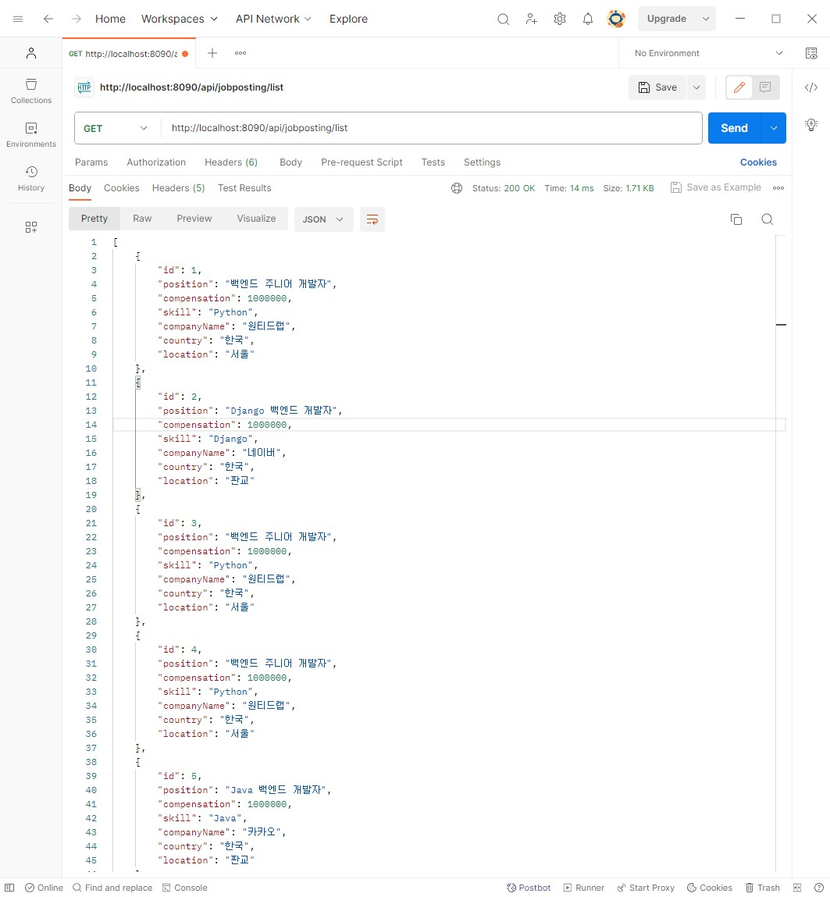
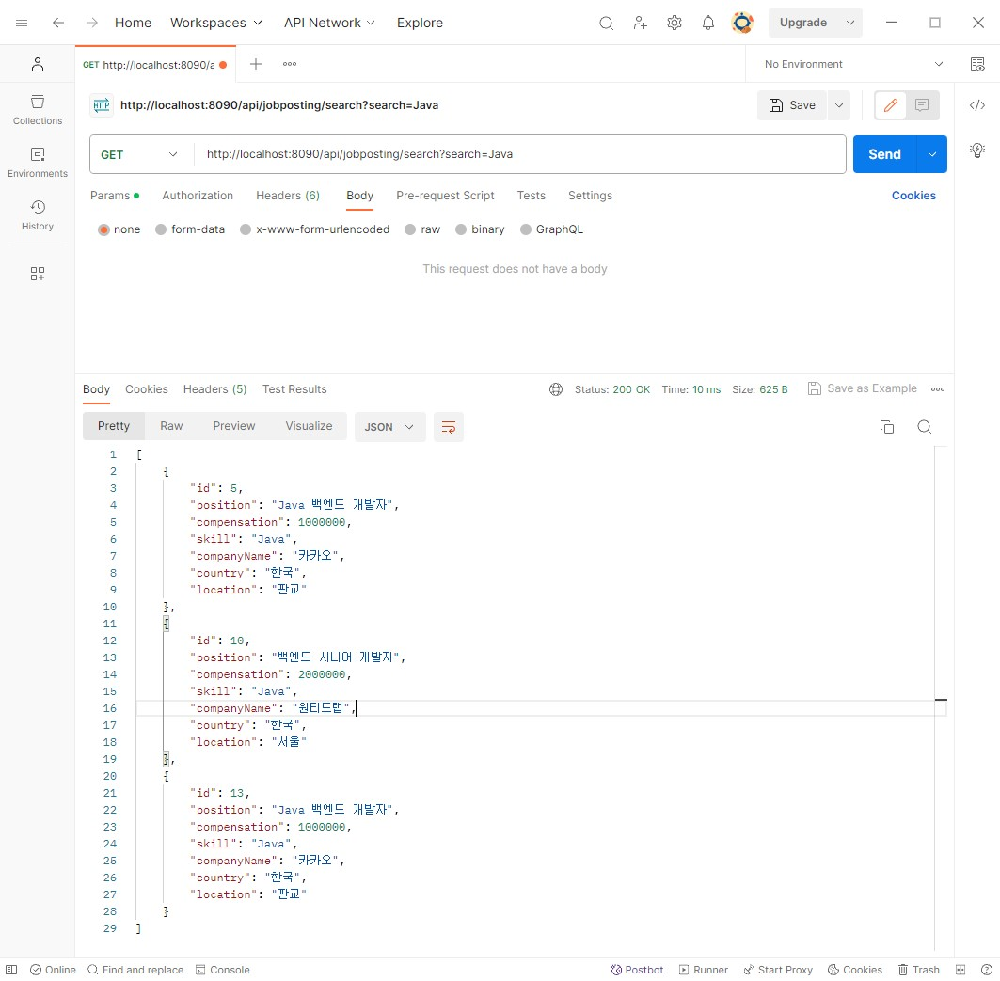
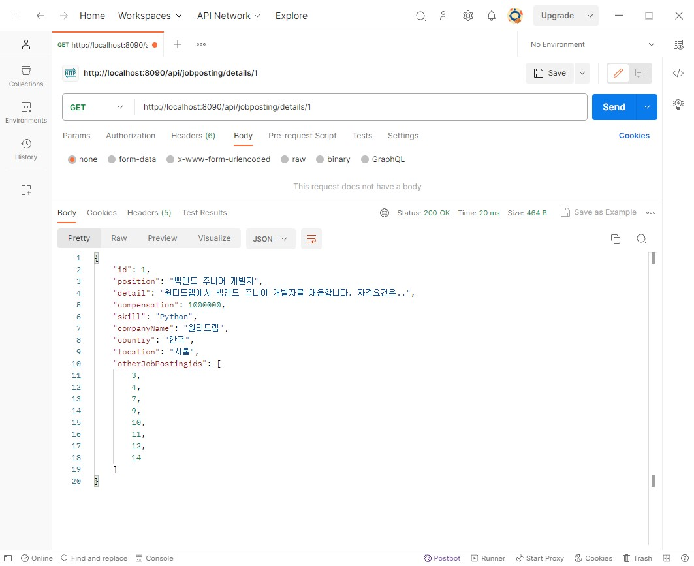
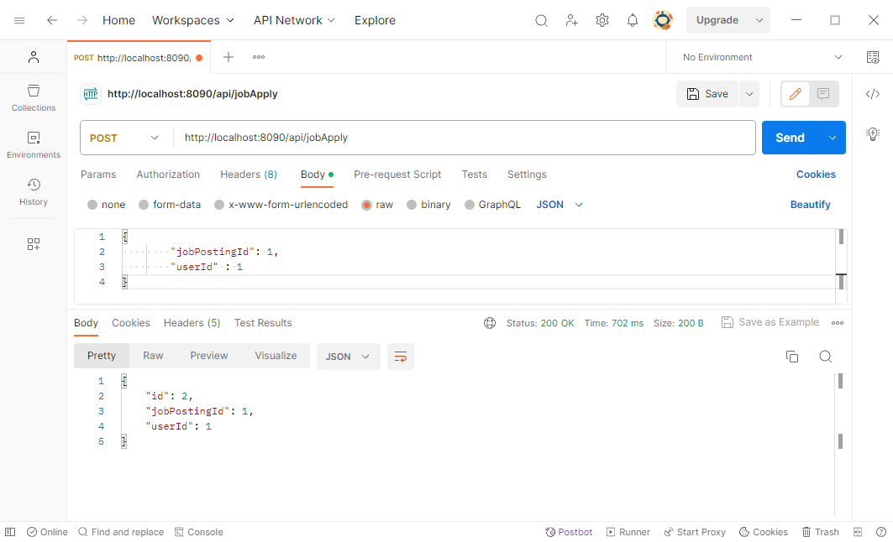
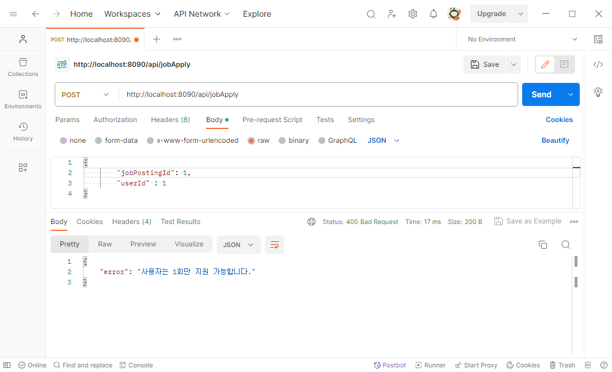

# wanted-pre-onboarding-backend

### 1. 요구사항 분석
- **서비스 개요**

   본 서비스는 기업의 채용을 위한 웹 서비스 입니다.
   회사는 채용공고를 생성하고, 이에 사용자는 지원합니다.


- **기능적 요구사항**
   
   ORM, RDBMS를 사용하여 구현하고 구현항목은 다음과 같습니다.

  1. **채용공고를 등록합니다.**

       <aside>
       ➡️ 회사는 아래 데이터와 같이 채용공고를 등록합니다.

       </aside>

       ```json
       Example)
       # 데이터 예시이며, 필드명은 임의로 설정가능합니다.
       {
         "회사_id":회사_id,
         "채용포지션":"백엔드 주니어 개발자",
         "채용보상금":1000000,
         "채용내용":"원티드랩에서 백엔드 주니어 개발자를 채용합니다. 자격요건은..",
         "사용기술":"Python"
       }
       ```

  2. **채용공고를 수정합니다.**

      <aside>
      ➡️ 회사는 아래 데이터와 같이 채용공고를 수정합니다. (회사 id 이외 모두 수정 가능합니다.)

      </aside>

      ```json
      Example)
      # 데이터 예시이며, 필드명은 임의로 설정가능합니다.
      {
        "채용포지션":"백엔드 주니어 개발자",
        "채용보상금":1500000, # 변경됨
        "채용내용":"원티드랩에서 백엔드 주니어 개발자를 '적극' 채용합니다. 자격요건은..", # 변경됨
        "사용기술":"Python"
      }
    
      or
    
      {
        "채용포지션":"백엔드 주니어 개발자",
        "채용보상금":1000000,
        "채용내용":"원티드랩에서 백엔드 주니어 개발자를 채용합니다. 자격요건은..",
        "사용기술":"Django" # 변경됨
      }
      ```

  3. **채용공고를 삭제합니다.**

      <aside>
      ➡️ DB에서 삭제됩니다.

      </aside>

  4. **채용공고 목록을 가져옵니다.**

      <aside>
      ➡️ 4-1. 사용자는 채용공고 목록을 아래와 같이 확인할 수 있습니다.

      </aside>

      ```json
      Example)
      [
          {
              "채용공고_id": 채용공고_id,
            "회사명":"원티드랩",
            "국가":"한국",
            "지역":"서울",
            "채용포지션":"백엔드 주니어 개발자",
            "채용보상금":1500000,
            "사용기술":"Python"
          },
          {
              "채용공고_id": 채용공고_id,
            "회사명":"네이버",
            "국가":"한국",
            "지역":"판교",
            "채용포지션":"Django 백엔드 개발자",
            "채용보상금":1000000,
            "사용기술":"Django"
          },
        ...
      ]
      ```

      <aside>
      ➡️ 4-2. 채용공고 검색 기능 구현**(선택사항 및 가산점요소).**

      </aside>

      ```json
      # Example - 1) some/url?**search=원티드**
      [
          {
              "채용공고_id": 채용공고_id,
            "회사명":"원티드랩",
            "국가":"한국",
            "지역":"서울",
            "채용포지션":"백엔드 주니어 개발자",
            "채용보상금":1500000,
            "사용기술":"Python"
          },
          {
              "채용공고_id": 채용공고_id,
            "회사명":"원티드코리아",
            "국가":"한국",
            "지역":"부산",
            "채용포지션":"프론트엔드 개발자",
            "채용보상금":500000,
            "사용기술":"javascript"
          }
      ]
    
      # Example - 2) some/url?**search=Django**
      [
          {
              "채용공고_id": 채용공고_id,
            "회사명":"네이버",
            "국가":"한국",
            "지역":"판교",
            "채용포지션":"Django 백엔드 개발자",
            "채용보상금":1000000,
            "사용기술":"Django"
          },
          {
              "채용공고_id": 채용공고_id,
            "회사명":"카카오",
            "국가":"한국",
            "지역":"판교",
            "채용포지션":"Django 백엔드 개발자",
            "채용보상금":500000,
            "사용기술":"Python"
          }
        ...
      ]
      ```

  5. **채용 상세 페이지를 가져옵니다.**

      <aside>
      ➡️ 사용자는 채용상세 페이지를 아래와 같이 확인할 수 있습니다.

      - “채용내용”이 추가적으로 담겨있음.
      - 해당 회사가 올린 다른 채용공고 가 추가적으로 포함됩니다**(선택사항 및 가산점요소).**
      </aside>

      ```json
      Example)
      {
      "채용공고_id": 채용공고_id,
      "회사명":"원티드랩",
      "국가":"한국",
      "지역":"서울",
      "채용포지션":"백엔드 주니어 개발자",
      "채용보상금":1500000,
      "사용기술":"Python",
      "채용내용": "원티드랩에서 백엔드 주니어 개발자를 채용합니다. 자격요건은..",
      "회사가올린다른채용공고":[채용공고_id, 채용공고_id, ..] # id List (선택사항 및 가산점요소).
      }
      ```

  6. **사용자는 채용공고에 지원합니다(선택사항 및 가산점요소).**

      <aside>
      ➡️ 사용자는 채용공고에 아래와 같이 지원합니다. (가점 요소이며, 필수 구현 요소가 아님)

      - 사용자는 1회만 지원 가능합니다.
      </aside>

      ```json
      Example)
      {
          "채용공고_id": 채용공고_id,
        "사용자_id": 사용자_id
      }
      ```

### 2. 구현 과정
1. **프로젝트 설정 및 초기 세팅:**
   


2. **ERD 작성:**
   


3. **채용공고 등록 기능 구현**

   ```agsl
    public JobPosting createJobPosting(JobPostingDTO jobPostingDTO) {
        JobPosting jobPosting = new JobPosting();
        BeanUtils.copyProperties(jobPostingDTO, jobPosting);

        Integer companyId = jobPostingDTO.getCompanyId();
        Company company = companyRepository.findById(companyId)
                .orElseThrow(() -> new RuntimeException("해당 ID의  회사를 찾을 수 없음 : " + companyId));

        jobPosting.setCompany(company);

        return jobPostingRepository.save(jobPosting);
    }
   ```
   <aside>
   ➡️ JobPostingDTO에서 필요한 정보를 추출하여 JobPosting 객체를 생성하고 해당 객체에 회사 정보를 추가한 후 저장합니다.
   </aside>
   <br>

   ```agsl
    @PostMapping("/create")
       public ResponseEntity<JobPosting> createJobPosting(@RequestBody JobPostingDTO jobPostingDTO) {
           JobPosting jobPosting = jobPostingService.createJobPosting(jobPostingDTO);
           return new ResponseEntity<>(jobPosting, HttpStatus.CREATED);
       }
   ```
   <aside>
   ➡️ 클라이언트가 전송한 JobPostingDTO를 jobPostingService.createJobPosting 메서드를 호출하여 채용공고를 생성합니다. 생성된 공고를 ResponseEntity에 담아 HTTP 상태코드와 함께 반환합니다.
   </aside>
   <br>
   
   *️ **api 요청 테스트**<br>
   


4. **채용공고 수정 기능 구현**
   ```agsl
   public JobPosting updateJobPosting(Integer id, JobPostingDTO jobPostingDTO) {
           JobPosting jobPosting = jobPostingRepository.findById(id)
                   .orElseThrow(() -> new RuntimeException("해당 id의 채용공고 찾을 수 없음 : "+ id));
   
           jobPosting.setPosition(jobPostingDTO.getPosition());
           jobPosting.setCompensation(jobPostingDTO.getCompensation());
           jobPosting.setDetail(jobPostingDTO.getDetail());
           jobPosting.setSkill(jobPostingDTO.getSkill());
   
           return jobPostingRepository.save(jobPosting);
       }
   ```
   <aside>
   *️⃣ jobPostingRepository.findById(id)를 사용하여 id에 해당하는 채용공고를 찾고 jobpostingDTO로부터 받은 정보를 사용하여 채용공고를 업데이트합니다.
   </aside>
   <br>

   ```agsl
    @PutMapping("/update/{id}")
       public ResponseEntity<JobPosting> updateJobPosting(@PathVariable Integer id, @RequestBody JobPostingDTO jobPostingDTO) {
           JobPosting jobPosting = jobPostingService.updateJobPosting(id, jobPostingDTO);
           return new ResponseEntity<>(jobPosting, HttpStatus.OK);
       }
   ```
   <aside>
   *️⃣ /update/{id} 엔드포인트에 PUT 요청이 오면 메서드가 실행됩니다. 
   클라이언트가 요청한 데이터를 jobPostingDTO 객체로 매핑하고 jobPostingService.updateJobPosting(id, jobPostingDTO)를 호출하여 주어진 id에 해당하는 채용공고를 업데이트합니다.
   HTTP 상태코드 200과 함께 업데이트된 채용공고를 클라이언트에 반환합니다.
   </aside>
   <br>
   
   *️ **api 요청 테스트**<br>
   


5. **채용공고 삭제 기능 구현**
   ```agsl
    public void deleteJobPosting(Integer id) {
        jobPostingRepository.findById(id)
                .orElseThrow(() -> new RuntimeException("해당 id의 채용공고 찾을 수 없음 : " + id));

        jobPostingRepository.deleteById(id);
    }
   ```
   <aside>
   *️⃣ jobPostingRepository.findById(id)를 호출하여 id에 해당하는 채용공고를 찾고 없으면 예외를 발생시키고 있으면 jobPostingRepository.deleteById(id)를 호출하여 삭제합니다. 
   </aside>
   <br>

   ```agsl
    @DeleteMapping("/delete/{id}")
    public ResponseEntity<String> deleteJobPosting(@PathVariable Integer id) {
        jobPostingService.deleteJobPosting(id);
        return new ResponseEntity<>("채용공고가 삭제되었음.", HttpStatus.OK);
    } 
   ```
   <aside>
   *️⃣  /delete/{id} 엔드포인트에 DELETE 요청이 오면 메서드가 실행됩니다.
   URL에서 id를 추출하고 jobPostingService.deleteJobPosting(id)를 호출하여 id에 해당하는 채용공고를 삭제합니다.
   채용공고가 성공적으로 삭제되면 "채용공고가 삭제되었음." 메시지와 HTTP 상태 코드 200을 반환합니다.
   </aside>
   <br>

   *️ **api 요청 테스트**<br>
   


6. **채용공고 목록 구현**
   ```agsl
    public List<JobPostingListDTO> getJobPostingsList() {
        return jobPostingRepository.findAll()
                .stream().map(JobPostingListDTO::new)
                .toList();
    }
   ```
   <aside>
   *️⃣ jobPostingRepository.findAll()로 모든 채용공고를 db에서 가져옵니다.
   </aside>
   <br>

   ```agsl
    @GetMapping("/list")
    public ResponseEntity<List<JobPostingListDTO>> getJobPostingsList() {
        return ResponseEntity.ok(jobPostingService.getJobPostingsList());
    }
   ```
   <aside>
   *️⃣  /list 엔드포인트에 GET 요청이 오면 메서드가 실행됩니다.
   jobPostingService.getJobPostingsList()를 호출하여 채용공고 목록을 가져옵니다.
   채용공고 목록을 HTTP 상태코드 200과 함께 반환합니다.
   </aside>
   <br>

   *️ **api 요청 테스트**<br>
   


7. **채용공고 검색 기능 구현**
   ```agsl
    public List<JobPostingListDTO> searchJobPosting(String keyword) {
        return jobPostingRepository.findByPositionContainingOrSkillContainingOrCompanyId_NameContainingOrCompanyId_CountryContainingOrCompanyId_LocationContaining
                        (keyword, keyword, keyword, keyword, keyword)
                .stream().map(JobPostingListDTO::new)
                .toList();
    }
   ```
   <aside>
   *️⃣ Spring Data JPA의 네이밍 규칙을 사용하여 키워드를 포함하는 채용공고를 검색합니다.
   검색된 채용공고들을 jobPostingListDTO로 매핑하고 리스트로 반환합니다.
   </aside>
   <br>

   ```agsl
    @GetMapping("/search")
    public ResponseEntity<List<JobPostingListDTO>> searchJobPosting(@RequestParam("search") String keyword) {
        return ResponseEntity.ok(jobPostingService.searchJobPosting(keyword));
    }
   ```
   <aside>
   *️⃣ /search 엔드포인트에 GET 요청이 오면 메서드가 실행됩니다.
   jobPostingService.searchJobPosting(keyword)를 호출하여 검색을 수행합니다.
   </aside>
   <br>

   *️ **api 요청 테스트**<br>
   


8. **채용공고 상세 페이지 구현**
   ```agsl
    public JobPostingDetailDTO getJobPostingById(Integer id) {
        JobPosting jobPosting = jobPostingRepository.findById(id)
                .orElseThrow(() -> new RuntimeException("해당 id의 채용공고 찾을 수 없음 : " + id));

        List<Integer> otherJobPostingIds = jobPostingRepository.findByCompanyId(jobPosting.getCompany().getId())
                .stream()
                .map(JobPosting::getId)
                .filter(postingId -> !postingId.equals(id))
                .collect(Collectors.toList());

        return new JobPostingDetailDTO(jobPosting, otherJobPostingIds);
    }
   ```
   <aside>
   *️⃣ jobPostingRepository.findById(id)로 id에 해당하는 채용공고를 찾고 없으면 예외를 발생시키고 있으면 가져옵니다.
   jobPostingRepository.findByCompanyId(jobPosting.getCompany().getId())로 동일한 회사id를 가진 다른 채용공고들을 db에서 가져와 현재 요청한 채용공고 id와 같이 않은 채용공고 id를 리스트로 수집합니다.
   이 정보와 함께 채용공고 상세 정보를 DTO를 생성하여 반환합니다.
   </aside>
   <br>

   ```agsl
    @GetMapping("/details/{id}")
    public ResponseEntity<JobPostingDetailDTO> getJobPostingById(@PathVariable Integer id) {
        return ResponseEntity.ok(jobPostingService.getJobPostingById(id));
    }
   ```
   <aside>
   *️⃣ /details/{id} 엔드포인트에 GET 요청이 오면 메서드가 실행됩니다.
   jobPostingService.getJobPostingById(id)를 호출하여 id에 해당하는 채용공고의 상세 정보를 상태코드와 함께 반환합니다.
   </aside>
   <br>

   *️ **api 요청 테스트**<br>
   


9. **채용공고 지원 기능 구현**
   ```agsl
    public HistoryDTO applyToJob(HistoryDTO historyDTO) {
        Integer jobPostingId = historyDTO.getJobPostingId();
        Integer userId = historyDTO.getUserId();

        if (historyRepository.existsByJobPostingIdAndUserId(jobPostingId, userId)) {
            throw new DuplicateException("사용자는 1회만 지원 가능합니다.");
        }

        JobPosting jobPosting = jobPostingRepository.findById(jobPostingId)
                .orElseThrow(() -> new RuntimeException("해당 id의 채용공고 찾을 수 없음 : " + jobPostingId));

        User user = userRepository.findById(userId)
                .orElseThrow(() -> new RuntimeException("해당 id의 사용자 찾을 수 없음: " + userId));

        History history = new History();
        history.setJobPosting(jobPosting);
        history.setUser(user);

        History savedHistory = historyRepository.save(history);

        historyDTO.setId(savedHistory.getId());
        historyDTO.setJobPostingId(savedHistory.getJobPosting().getId());
        historyDTO.setUserId(savedHistory.getUser().getId());

        return historyDTO;
    }
   ```
   <aside>
   *️⃣ historyRepository.existsByJobPostingIdAndUserId(jobPostingId, userId)로 중복 지원 여부를 확인하고 중복 지원일 경우 예외를 발생시킵니다.
   historyRepository.save(history) 이력을 저장하고 저장된 정보로 historyDTO를 업데이트한 후 반환합니다.
   </aside>
   <br>

   ```agsl
    @PostMapping("/jobApply")
    public ResponseEntity<?> applyToJob(@RequestBody HistoryDTO historyDTO) {
        try {
            HistoryDTO savedHistoryDTO = historyService.applyToJob(historyDTO);
            return ResponseEntity.ok(savedHistoryDTO);
        } catch (DuplicateException e) {
            return ResponseEntity.status(HttpStatus.BAD_REQUEST)
                    .body(Collections.singletonMap("error", "사용자는 1회만 지원 가능합니다."));
        }
    }
   ```
   <aside>
   *️⃣ /jobApply 엔드포인트에 POST 요청이 오면 메서드가 실행됩니다.
   historyService.applyToJob(historyDTO)를 호출하여 채용공고에 지원하고 지원내역을 반환합니다.
   이미 지원한 경우 예외처리와 함께 클라이언트에 적절한 에러 응답을 반환합니다.
   </aside>
   <br>

   *️ **api 요청 테스트**<br>
   
   * 지원을 1번 이상 했을 때
   

